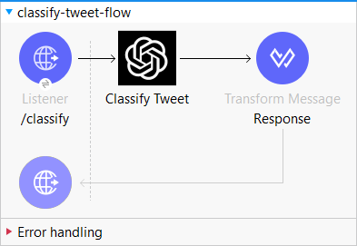

# ChatGPT Connector
This connector allows you to use ChatGPT for 3 primary operation.
The operations include :
- Classify Tweet
- Correct Grammar
- Summarize Text

# How to use this connector

To use this connector, run below command -
```
mvn clean install -DskipTests
```

Then, add this dependency to your application pom.xml

```
<groupId>in.bitmaksers.chatgpt</groupId>
<artifactId>chatgpt-connector</artifactId>
<version>1.0.0</version>
<classifier>mule-plugin</classifier>
```

# Example Flow

Here's an example flow showing the use of Classify Tweet Operation

